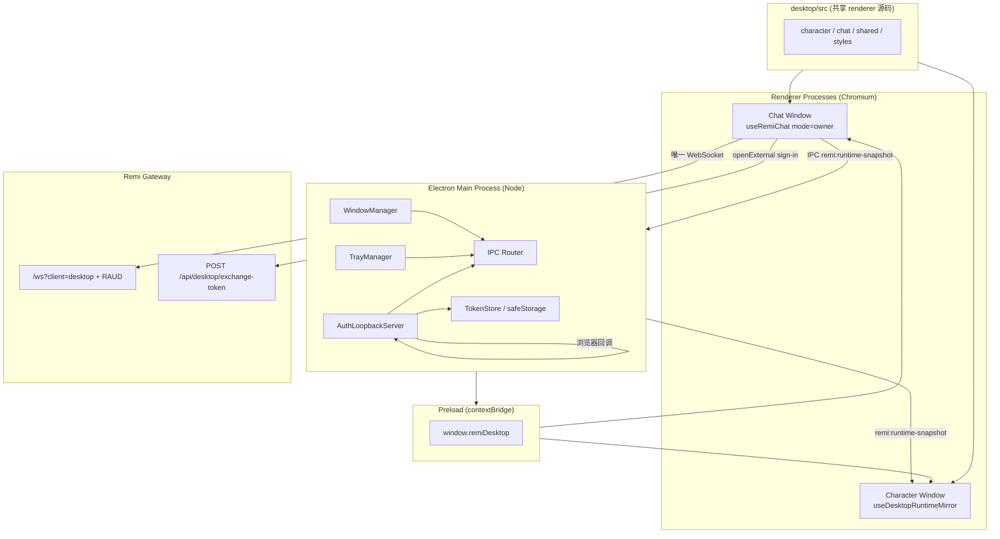
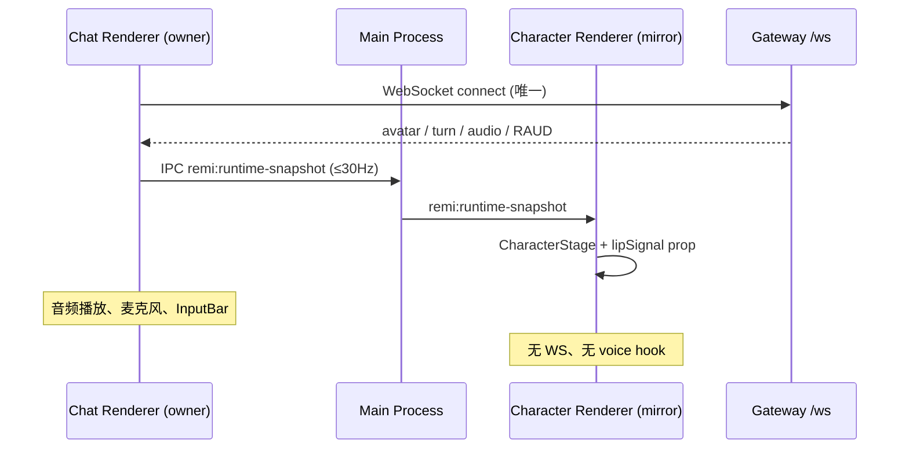

# Remi Electron 桌面端设计

| 字段 | 值 |
|------|-----|
| **作者** | @TBD |
| **日期** | 2026-06-20 |
| **状态** | Draft（Re-review 修订版） |
| **关联** | `desktop/`（Tauri v2 现状）、`docs/design/DESKTOP_MULTI_DEVICE_CLERK.md` |

---

## Overview

Remi 桌面端当前基于 **Tauri v2**（`desktop/`）：透明置顶角色浮窗（150×400）+ 可切换的磨砂聊天面板（380×600），通过 Vite alias 复用 `web/src` 的 `useRemiChat`、`CharacterStage`、`ChatWindow` 等核心逻辑，Rust 侧负责托盘、窗口定位、RFC 8252 loopback 登录。

本设计提出在 **`desktop-electron/`** 新建 Electron 客户端，**协议与 UX 与 Tauri 对齐**（同一 `/ws` + RAUD、同一双窗口在场模型），以 **TypeScript 单栈** 降低 Rust 维护成本，并换取更成熟的 **自动更新、Windows 打包、DevTools 调试** 生态。迁移策略为 **阶段性共存 → 功能 parity 后切换默认发行渠道**，而非一次性硬切。

预期首版（macOS）体积 ~120–180 MB（含 Chromium）。性能目标与测量方法见 [Observability → 性能指标](#性能指标与验收方法)：`app.ready_ms` < 3000（冷启动首装）、`avatar.first_frame_ms` < 500（Chat owner 收到首个 `avatarFrame` 后 Character 镜像渲染）。

---

## Background & Motivation

### 产品语境

Remi 不是通用 AI 助手。桌面端的核心 KPI 是 **「打开就能看见她」** 的在场感，而非效率工具。桌面端与 Web/iOS/watchOS 共享同一 WebSocket 协议，是「多端同一 Remi、同一份记忆」的载体之一（见 `docs/design/DESKTOP_MULTI_DEVICE_CLERK.md`——**注意**：该文档 §3.2–3.3 描述的 deep-link 回跳已被 loopback 实现取代，见 [References](#references)）。

### 现状（Tauri v2）— 已实现的资产

| 能力 | 实现位置 | 说明 |
|------|----------|------|
| 双窗口 | `desktop/src-tauri/tauri.conf.json` | `character` 透明置顶；`chat` 默认隐藏 |
| 点击切换聊天 | `desktop/src/character/CharacterApp.tsx` | 拖拽阈值 4px；`invoke("toggle_chat_panel")` |
| 聊天锚定角色窗 | `desktop/src-tauri/src/lib.rs` | `position_chat_near_character`，拖动角色时跟随 |
| 托盘 | `lib.rs` `TrayIconBuilder` | Show / Quit |
| 登录 loopback | `lib.rs` `start_auth_loopback` + `DesktopAuthProvider.tsx` | RFC 8252；`POST /api/desktop/exchange-token` 已上线 |
| 前端复用 | `desktop/vite.config.ts` | `@ → ../web/src`；`RemiAuthProvider` 别名到桌面 stub |
| Presence CSS | `desktop/src/styles/desktop.css` | 透明背景、Live2D flex 高度修复、聊天满高 |

### 痛点与迁移动机

1. **技能栈不对称**：前端/React/WS 协议迭代集中在 `web/src/hooks/useRemiChat.ts`（热点文件），Rust 窗口/鉴权层改动需要双栈 review，拖慢「实时交互质量」迭代。
2. **双 WebSocket 会话（已知技术债，严重度高）**：`CharacterApp` 与 `ChatPanelApp` **各自**调用 `useRemiChat()`，产生 **两条独立 `/ws` 连接**。经验证：`useRemiChat()` **无 options 参数**，内部始终组合 `useRemiConnection`（mount 即 auto-connect）与 `useRemiVoice`——角色窗虽无麦克风 UI，仍初始化完整 voice/duplex 基础设施。服务端视为两个 session，可导致 **duplicate `playback_start`、turn 状态分裂、双倍 TTS 资源占用**。这与 `CLAUDE.md` §0「实时交互质量」优先级 **直接冲突**；**任何对外 dogfood / 默认渠道切换前必须修复**（见 K5、PR 10）。
3. **发行与更新**：Tauri 自动更新可行但团队经验少；`electron-updater` + GitHub Releases / S3 是成熟路径，利于 Windows 后续铺开。
4. **调试**：Live2D/WebGL/RAUD 问题在 Electron DevTools + Chromium trace 下更易定位。
5. **Windows/Linux 长期 parity**：Tauri 跨平台能力足够，但 Remi 团队若主攻 TS，Electron 的社区范例（透明窗、托盘、loopback OAuth）更密集。

### 不迁移的理由（需诚实权衡）

| 维度 | Tauri 优势 | Electron 代价 |
|------|-----------|---------------|
| 安装包体积 | ~15–40 MB | ~120–180 MB |
| 内存占用 | 单 WebView，较低 | Chromium + Node，空闲 ~150–250 MB |
| 安全面 | Rust + 受限 IPC | Node integration 需严格隔离 |
| 透明窗 macOS | `macOSPrivateApi: true` 已验证 | 需 `transparent` + `setVibrancy()`；Windows 透明性能较差 |
| 已有投入 | loopback auth、双窗、托盘 **已完工** | 需移植 ~300 行 Rust 逻辑到 TS |

**结论**：Electron 不是「技术升级」，而是 **工程权衡**——用体积/内存换 TS 单栈、发行生态、IPC 统一会话。若团队 Rust 能力强且仅需 macOS，延续 Tauri 也合理；本设计假设 **产品路线图包含 Windows 桌面 + 更快迭代 presence UX**。

---

## Goals & Non-Goals

### Goals

1. **协议兼容**：同一 `VITE_WS_URL`、`/ws?token=`、`tts_transport=pcm_stream_v1`、二进制 RAUD 帧；握手 query 使用 `client=desktop`（见 [Observability](#observability)）。
2. **UX parity**：透明置顶角色窗、点击（非拖拽）切换聊天、拖动锚定、托盘、loopback 登录、磨砂聊天面板。
3. **代码复用最大化**：**唯一** renderer 源码树 `desktop/src/{character,chat,shared,styles}`，由 Tauri 与 Electron 两套 Vite 配置共同消费；继续 `@ → web/src` alias。
4. **单 WebSocket 会话（发布阻断项）**：聊天窗为 session owner，角色窗通过 IPC 镜像 avatar 字段；**dogfood 前必须完成**。
5. **macOS 首发**：签名、公证、自动更新跑通；Windows 列为 Phase 3。
6. **与 Tauri 共存**：根 `package.json` 提供明确脚本（见下）；本地可并行构建至 parity 验证完成。

**Canonical 开发命令**（将在 PR 1 写入根 `package.json`）：

| 脚本 | 作用 |
|------|------|
| `npm run desktop:dev:tauri` | 现有 Tauri dev（今日之 `desktop:dev`） |
| `npm run desktop:build:tauri` | 现有 Tauri build（今日之 `desktop:build`） |
| `npm run desktop:dev:electron` | Electron dev（`desktop-electron` workspace） |
| `npm run desktop:build:electron` | Electron macOS 打包 |

> 旧名 `desktop:dev` / `desktop:build` 保留为 `desktop:dev:tauri` / `desktop:build:tauri` 的 alias，避免破坏现有文档。

### Non-Goals

1. **不重写** `useRemiChat` 协议层或服务端 session 模型（仅增加 `mode` 选项与桌面 IPC 适配）。
2. **不在桌面端嵌入 Clerk SDK**（延续浏览器登录 + legacy JWT exchange）。
3. **不做** 离线模式、本地 LLM、插件系统。
4. **首版不做** Linux 官方支持（可做 best-effort）。
5. **不改动** Postgres/Redis 暴露策略（桌面仍只连 gateway，见 `DESKTOP_MULTI_DEVICE_CLERK.md`）。

---

## Proposed Design

### 总体架构



### 目录结构（定稿：共享 `desktop/src`，禁止复制）

```
remi/
├── desktop/                         # Tauri + **唯一** renderer 源码
│   ├── src/
│   │   ├── character/               # CharacterApp.tsx
│   │   ├── chat/                    # ChatPanelApp.tsx
│   │   ├── shared/
│   │   │   ├── DesktopAuthProvider.tsx
│   │   │   ├── desktopBridge.ts     # Tauri / Electron 抽象
│   │   │   ├── runtimeSnapshot.ts   # Phase 2 IPC schema
│   │   │   └── useDesktopRuntimeMirror.ts
│   │   └── styles/desktop.css
│   ├── src-tauri/
│   └── vite.config.ts               # Tauri renderer 构建
├── desktop-electron/                # 仅 Electron 壳（main / preload / 打包）
│   ├── package.json
│   ├── electron.vite.config.ts      # renderer root → ../desktop/src
│   ├── src/main/
│   │   ├── index.ts
│   │   ├── windows.ts
│   │   ├── tray.ts
│   │   ├── auth-loopback.ts
│   │   ├── token-store.ts
│   │   ├── open-external.ts         # URL allowlist
│   │   ├── ipc.ts
│   │   ├── logging.ts               # electron-log
│   │   └── updater.ts
│   ├── src/preload/
│   │   ├── index.ts
│   │   └── remiDesktop.d.ts         # window.remiDesktop 类型
│   └── electron-builder.yml
```

**关键约束**：`desktop-electron` **不复制** `desktop/src`。两套客户端改 UI 只改一处。`electron.vite.config.ts` 的 `renderer` 入口指向 `../desktop/index.html` 与 `../desktop/chat.html`（或等价配置）。

### Main Process 模块

#### 1. WindowManager（对应 `lib.rs` 窗口逻辑）

**Character 窗口**（`BrowserWindow`）：

```typescript
const characterWin = new BrowserWindow({
  width: 150,
  height: 400,
  resizable: false,
  alwaysOnTop: true,
  frame: false,
  transparent: true,
  backgroundColor: "#00000000",
  hasShadow: false,
  skipTaskbar: true,
  show: true,
  webPreferences: {
    preload: join(__dirname, "../preload/index.js"),
    contextIsolation: true,
    nodeIntegration: false,
    sandbox: true,
  },
});
// Parity 阶段 **不** 调用 setVisibleOnAllWorkspaces（Tauri 无此行为）。
// 见下文「Electron 增强（post-parity）」。
```

**Chat 窗口**：

```typescript
const chatWin = new BrowserWindow({
  width: 380,
  height: 600,
  minWidth: 320,
  minHeight: 400,
  resizable: true,
  frame: true,
  transparent: true,
  backgroundColor: "#00000000",
  show: false,
  webPreferences: { /* 同上 */ },
});
if (process.platform === "darwin") {
  chatWin.setVibrancy("under-window");
}
// Windows / Linux：无 vibrancy API；依赖 ChatPanelApp CSS
//   backdrop-filter: blur(20px) + rgba(5,10,16,0.78)（已有）
```

**行为契约**（与 Tauri 对齐）：

| 事件 | 行为 |
|------|------|
| `character` `moved` | 若 chat 可见 → `positionChatNearCharacter()` |
| `chat` `close` | `preventDefault` + `hide()` |
| IPC `toggle-chat-panel` | 切换可见性 + 定位 + focus |
| 托盘 Show | `character.show()` + `focus()` |

`positionChatNearCharacter` 直接移植 `lib.rs:154-196` 算法：`CHAT_GAP = 8`，右侧优先，溢出则左侧，最后 clamp 到 `screen.getDisplayMatching(bounds)`。

#### 1.1 透明窗点击穿透（Phase 1 Spike 验收项）

Tauri 现状：**整个 150×400 矩形捕获鼠标**，透明像素也阻挡桌面图标点击。Electron parity 默认保持一致。

| 模式 | 行为 | 阶段 |
|------|------|------|
| **矩形捕获（默认）** | 与 Tauri 相同；整块区域可拖拽/点击切换 | Phase 1 parity |
| **穿透 + 交互岛** | `setIgnoreMouseEvents(true, { forward: true })` + 角色 mesh AABB 内 `-webkit-app-region: no-drag` 岛 | Phase 1 spike（PR 2） |

**Spike 验收**（PR 2 manual QA）：

1. 角色窗置于桌面图标上方：默认模式下图标不可点（记录为 known limitation，与 Tauri 一致）。
2. Spike 模式下：透明区可点穿桌面；角色躯体区域仍可拖拽；单击（非拖拽）仍可 `toggle-chat-panel`。
3. 若 spike 导致拖拽/点击判定不可靠 → **defer 到 Phase 3**，不在 parity 阻断；文档记录 failure mode。

**失败模式（若 defer）**：用户抱怨「Remi 挡桌面」——与当前 Tauri 体验相同，非 Electron 回退。

#### 2. TrayManager

使用 `Tray` + `Menu`：`Show Remi`、`Quit Remi`；左键单击托盘图标 = Show（与 Tauri `on_tray_icon_event` 一致）。

#### 3. AuthLoopbackServer（移植 `start_auth_loopback`）

```typescript
// desktop-electron/src/main/auth-loopback.ts
export async function startAuthLoopback(): Promise<{ port: number; state: string }> {
  const state = crypto.randomUUID();
  const server = http.createServer((req, res) => { /* 解析 GET /callback?token&state */ });
  await new Promise<void>((resolve, reject) => {
    server.listen(0, "127.0.0.1", () => resolve());
    server.on("error", reject);
  });
  const port = (server.address() as AddressInfo).port;
  // 300s 超时、单次 accept、state 校验 → tokenStore.set + broadcast auth-token-updated
  return { port, state };
}
```

与 `desktop/src-tauri/src/lib.rs:57-149` **字节级契约一致**。

**Token 存储（main process only）**：

- `safeStorage.encryptString(token)` → `{userData}/auth.json` 字段 `session_token`。
- **语义对齐、编码不同**：Tauri `tauri_plugin_store` 写 **明文 JSON**；Electron 写 **加密 ciphertext**——**不可**直接复制文件跨客户端。可选一次性迁移工具（Phase 2 ops）：检测 Tauri 明文 `auth.json` → 读入 → 用 Electron `safeStorage` 重加密（见 [Data Model](#data-model-changes)）。
- 广播：`webContents.getAllWebContents()` 发送 `remi:auth-token-updated`。

#### 4. IPC Router

| Channel | 方向 | Payload | 说明 |
|---------|------|---------|------|
| `remi:toggle-chat-panel` | invoke | `void` | 切换聊天窗 |
| `remi:start-auth-loopback` | invoke | `{ port, state }` | 启动 loopback |
| `remi:get-session-token` | invoke | `string \| null` | 读解密 token（**renderer 不碰文件**） |
| `remi:clear-session-token` | invoke | `void` | 登出 |
| `remi:open-external` | invoke | `url: string` | 经 allowlist 校验后 `shell.openExternal` |
| `remi:auth-token-updated` | event | `token: string` | 登录成功推送 |
| `remi:runtime-snapshot` | event | `RuntimeSnapshot` | Chat owner → main → character mirror |

#### 4.1 `openExternal` Allowlist（main handler）

**Allowlist 来源（source of truth）**：

| 来源 | 变量 / 机制 | 用途 |
|------|-------------|------|
| Web 登录页 | `VITE_WEB_URL` → `new URL(...).hostname` | `openDesktopSignIn` 打开的 `/sign-in?desktop=1` |
| Clerk Frontend API（可选） | `VITE_CLERK_FRONTEND_API` | 生产/预发 Clerk FAPI host，如 `clerk.example.com` |
| 开发默认 | 内置 `accounts.dev`、`clerk.accounts.dev` | Clerk dev 租户 |

`electron.vite.config.ts` 将 `VITE_WEB_URL`、`VITE_CLERK_FRONTEND_API` 传入 main process（`process.env` 或 `define`）。**不**从 `CLERK_PUBLISHABLE_KEY` 推导 host——避免 pk 格式变更导致 silent break。

> **OAuth 重定向不在桌面 `openExternal` 路径**：Google OAuth 在系统浏览器完成；桌面仅 `openExternal` 打开初始 sign-in URL。Allowlist 仍须覆盖未来可能经 `openExternal` 打开的 Clerk 页（密码重置、强制 HTTPS 跳转）。

```typescript
// desktop-electron/src/main/open-external.ts
function buildAllowedHosts(webBaseUrl: string, clerkFapi?: string): Set<string> {
  const hosts = new Set<string>([
    new URL(webBaseUrl).hostname,
    "accounts.dev",
    "clerk.accounts.dev",
  ]);
  if (clerkFapi?.trim()) {
    try { hosts.add(new URL(clerkFapi).hostname); } catch { /* ignore */ }
  }
  return hosts;
}

export function validateExternalUrl(
  raw: string,
  webBaseUrl: string,
  clerkFapi?: string,
): URL | null {
  const url = new URL(raw);
  const isLocalDev = url.hostname === "localhost" || url.hostname === "127.0.0.1";
  if (url.protocol !== "https:" && !(isLocalDev && url.protocol === "http:")) return null;
  if (!buildAllowedHosts(webBaseUrl, clerkFapi).has(url.hostname)) return null;
  return url;
}
```

**PR 8 验收**：`test/desktop/open-external.test.ts` 覆盖 dev host（`accounts.dev`）、`VITE_WEB_URL` host、可选 `VITE_CLERK_FRONTEND_API` host；拒绝未知 host / `javascript:`。Sign-in E2E（PR 7）在 allowlist 启用下通过。

拒绝时 `electron-log` 记录 `openExternal.rejected`（不泄露完整 token URL）。

### Preload 契约

```typescript
// desktop-electron/src/preload/index.ts
contextBridge.exposeInMainWorld("remiDesktop", {
  toggleChatPanel: () => ipcRenderer.invoke("remi:toggle-chat-panel"),
  startAuthLoopback: () => ipcRenderer.invoke("remi:start-auth-loopback"),
  getSessionToken: () => ipcRenderer.invoke("remi:get-session-token"),
  clearSessionToken: () => ipcRenderer.invoke("remi:clear-session-token"),
  openExternal: (url: string) => ipcRenderer.invoke("remi:open-external", url),
  onAuthTokenUpdated: (cb: (token: string) => void) => { /* ... */ },
  onRuntimeSnapshot: (cb: (snap: RuntimeSnapshot) => void) => { /* ... */ },
  publishRuntimeSnapshot: (snap: RuntimeSnapshot) =>
    ipcRenderer.send("remi:runtime-snapshot", snap),
});
```

`desktop-electron/src/preload/remiDesktop.d.ts` 提供全局类型；`desktop/src/shared/desktopBridge.ts` 在编译期引用。

### Renderer 适配：`desktopBridge`

统一 Tauri / Electron 后端，**所有** native 能力经此入口。

**⚠️ 打包约束（Electron 构建阻断）**：`desktopBridge.ts` **禁止** 任何静态 `import` / `require` from `@tauri-apps/*`。Electron renderer 与 Tauri 共享此文件（K4）；静态 Tauri 依赖会导致 Vite 将 Tauri 代码打入 Chromium bundle 或在 resolve 阶段失败。

- **所有** `@tauri-apps/api`、`@tauri-apps/plugin-shell`、`@tauri-apps/plugin-store` 引用 **仅** 存在于 `desktopBridge.tauri.ts`。
- `desktopBridge.ts` 在运行时 `isElectron()` 分支走 `window.remiDesktop`；否则 **动态** `import("./desktopBridge.tauri")`（与 `getSessionToken` 同模式，**每个** Tauri 方法均如此）。

```typescript
// desktop/src/shared/desktopBridge.ts — 零 @tauri-apps 静态 import
function isElectron(): boolean {
  return typeof window.remiDesktop !== "undefined";
}

async function tauri() {
  return import("./desktopBridge.tauri");
}

export const desktopBridge = {
  toggleChatPanel: () =>
    isElectron()
      ? window.remiDesktop!.toggleChatPanel()
      : tauri().then((m) => m.toggleChatPanel()),

  startAuthLoopback: () =>
    isElectron()
      ? window.remiDesktop!.startAuthLoopback()
      : tauri().then((m) => m.startAuthLoopback()),

  getSessionToken: () =>
    isElectron()
      ? window.remiDesktop!.getSessionToken()
      : tauri().then((m) => m.readTauriToken()),

  clearSessionToken: () =>
    isElectron()
      ? window.remiDesktop!.clearSessionToken()
      : tauri().then((m) => m.clearTauriToken()),

  onAuthTokenUpdated: (cb: (token: string) => void) =>
    isElectron()
      ? window.remiDesktop!.onAuthTokenUpdated(cb)
      : tauri().then((m) => m.listenTauriAuth(cb)),

  openExternal: (url: string) =>
    isElectron()
      ? window.remiDesktop!.openExternal(url)
      : tauri().then((m) => m.openExternal(url)),
};
```

```typescript
// desktop/src/shared/desktopBridge.tauri.ts — 唯一允许 @tauri-apps/* 的文件
import { invoke } from "@tauri-apps/api/core";
import { open } from "@tauri-apps/plugin-shell";
import { load } from "@tauri-apps/plugin-store";
// toggleChatPanel, startAuthLoopback, readTauriToken, ...
```

**Electron Vite 额外防护**（`electron.vite.config.ts`，PR 7）：

```typescript
resolve: {
  alias: {
    // 若 tree-shaking 仍解析到 tauri 子路径，指向空 stub
    "@tauri-apps/api/core": path.resolve(__dirname, "src/stubs/tauri-empty.ts"),
    "@tauri-apps/plugin-shell": path.resolve(__dirname, "src/stubs/tauri-empty.ts"),
    "@tauri-apps/plugin-store": path.resolve(__dirname, "src/stubs/tauri-empty.ts"),
  },
},
```

`tauri-empty.ts` 导出空实现；正常路径不应命中（动态 import 在 Electron 不执行）。**PR 5 验收**：`desktopBridge.ts` AST 无 `@tauri-apps` 字符串；**PR 7 验收**：`npm run desktop:build:electron` 编译通过且无 Tauri 模块进入 renderer bundle（`rollup-plugin-visualizer` 或 grep dist 抽查）。

### `DesktopAuthProvider` 改造（必做）

今日实现（`desktop/src/shared/DesktopAuthProvider.tsx`）在 renderer 内直接用 `load(AUTH_STORE_FILE)` / `store.get/set/delete`——**无** Tauri invoke。Electron 路径必须改为 **IPC-only**：

| 操作 | Tauri 路径 | Electron 路径 |
|------|-----------|---------------|
| 冷启动 hydrate | `plugin-store` 读 `session_token` | `desktopBridge.getSessionToken()` |
| 登录成功 | `listen(AUTH_EVENT)` | `desktopBridge.onAuthTokenUpdated()` |
| 登出 | `store.delete` + `save` | `desktopBridge.clearSessionToken()` |
| 打开登录页 | `startAuthLoopback` + `openExternal` | 同上经 `desktopBridge` |

**登出 UI**：当前 `ChatPanelApp` **无** 登出按钮（`canSignOut` 未使用）——** intentional**，与 Tauri 一致；登出留待设置页 PR。`signOut()` API 仍实现以供未来使用。

### `useRemiChat` 模式 API（发布阻断项的前置）

`useRemiChat()` 今日无参数。新增：

```typescript
// web/src/hooks/useRemiChat.ts
export type RemiChatMode = "owner" | "mirror";

export type UseRemiChatOptions = {
  /**
   * owner: 完整 WS + voice + messages（Chat 窗 **始终** owner）
   * mirror: 不创建 WS、不初始化 voice；Character 在 SINGLE_WS=0 时的 IPC 未接线回退
   */
  mode?: RemiChatMode;
};

export function useRemiChat(options: UseRemiChatOptions = {}) {
  const mode = options.mode ?? "owner";
  // useRemiConnection: skip when mode === "mirror"
  // useRemiVoice: skip when mode === "mirror"
  // ...
}
```

`useRemiConnection` 增加 `enabled: boolean`（`mode === "owner"` 时为 true）。

**`REM_DESKTOP_SINGLE_WS` 语义矩阵（定稿）**：

| 时期 | `SINGLE_WS` | Chat 窗 | Character 窗 | 说明 |
|------|-------------|---------|--------------|------|
| **Pre-PR-10** | 任意（通常 `0`） | `useRemiChat()` 默认 owner | `useRemiChat()` 默认 owner | **遗留双 WS**；仅 PR 7 窗口/登录冒烟；与 Tauri 相同 |
| **Post-PR-10** | `0` | `useRemiChat({ mode: "owner" })` **始终** | `useRemiChat({ mode: "mirror" })` | **UI shell 模式**：Chat 单 WS 连 gateway；Character 无 IPC 镜像、无 WS——avatar 静止，用于纯窗口/layout 调试 |
| **Post-PR-10** | `1` | `useRemiChat({ mode: "owner" })` | `useDesktopRuntimeMirror()` | **目标架构**；dogfood / release **必须** |

关键规则：

1. **Chat 永远是 owner**（Post-PR-10 起）——`SINGLE_WS` **只控制 Character 侧**走 IPC 镜像还是 `mirror` 空壳。
2. `SINGLE_WS=0` Post-PR-10 **不是**「双 WS 回归」；双 owner 仅存在于 **Pre-PR-10 分支**。
3. PR 7 Auth E2E / WS 冒烟：Pre-PR-10 用遗留双 WS 或临时未合并 PR 10 分支；Post-PR-10 起 **任何 WS 测试默认 `SINGLE_WS=1`**。
4. 阶段 0「允许临时双 WS」**仅指 Pre-PR-10 窗口调试**，不与 Post-PR-10 的 `SINGLE_WS=0` 混淆。

> **不存在** `autoConnect: false` 选项。

### 单 WebSocket + IPC 镜像（目标架构，发布阻断）



**Chat renderer（Session Owner）**：

- `useRemiChat({ mode: "owner" })`
- `publishRuntimeSnapshot(buildRuntimeSnapshot(chat))` on `runtimeState` / `lipSignalRef` 变更

**Character renderer（Mirror）**：

- `useDesktopRuntimeMirror()` 订阅 IPC
- **不调用** `useRemiChat()`
- 将 snapshot 喂给 `CharacterStage`

**`useDesktopRuntimeMirror` + lip-sync 路径**：

桌面角色渲染链：`CharacterStage` → **`Remi3DAvatar`**（Live2D，主路径）/ `RemiPortraitAvatar`（VRM 回退）。二者均以 ~48ms 轮询 `lipSignalRef`，读取 `{ envelope, active, viseme }`。`Remi3DAvatar` 在 init 时调用 `runtime.setLipSignal(lipSignalRef.current)` **一次**（`Remi3DAvatar.tsx:93`），IPC 镜像须持续更新。

**统一方案（prop 路径，PR 10）**：

1. `CharacterStage` 增加可选 `lipSignal?: LipSignal` prop，向下传给 `Remi3DAvatar` / `RemiPortraitAvatar`。
2. 当 `lipSignal` prop 存在时，组件 **不读** `lipSignalRef`。
3. **`Remi3DAvatar`**：新增 `useEffect(() => { runtimeRef.current?.setLipSignal(lipSignal); }, [lipSignal])`，每次 IPC snapshot 更新嘴型（Live2D dogfood 必测项）。
4. `RemiPortraitAvatar`：同等 `useEffect` 或停止 ref 轮询改读 prop。

`useDesktopRuntimeMirror` 将 snapshot 的 `lipSignal` 直接作为 prop 传入 `CharacterStage`——**不**维护跨进程 ref（实现时只保留 prop 路径）。

**隐藏 chat 窗仍播放音频**：`hide()` 不 `destroy()`。

**Throttle**：≤30 Hz；**优先字段**：`lipSignal`（含 `viseme`）、`avatarFrame`、`avatarIntent`、`runtimeState.phase`、`runtimeState.assistant.playbackActive`。不下发 `messages` / `historyHasMore`。

### Auth 流程（延续 loopback，非 deep link）

现状已实现 loopback。Tauri `tauri.conf.json` 注册 `ai.remi.desktop` deep-link，但 **`lib.rs` 无 handler**。Electron **沿用 loopback**。

（序列图同前版，略。）

### Presence UX 规格

| 状态 | 角色窗 | 聊天窗 |
|------|--------|--------|
| **Idle** | Live2D/VRM 呼吸 idle；透明背景 | 隐藏或显示历史 |
| **Listening** | `userSpeaking` / 录音指示 | InputBar 麦克风激活 |
| **Thinking** | `busy`（`phase === "thinking"`） | ChatWindow status |
| **Speaking** | `voiceActive` + `lipSignal`（含 viseme） | 流式文本 + TTS |
| **点击** | 切换 chat 显隐 | — |
| **拖拽** | 移动角色窗；chat 跟随 | 独立移动 |

### Electron 增强（post-parity，非阻断）

| 增强 | 说明 |
|------|------|
| `setVisibleOnAllWorkspaces(true)` | 全 Spaces / 全屏可见；**Tauri 无**，需单独 dogfood |
| 逐像素点击穿透 | Spike 未通过时推迟 |

### 构建与打包

| 项 | 选择 | 说明 |
|----|------|------|
| 脚手架 | **electron-vite** | renderer 指回 `desktop/` |
| 打包 | **electron-builder** | macOS DMG + zip |
| 签名 | Apple Developer ID + `notarize` | 见 PR 11 CI 设计 |
| 自动更新 | `electron-updater` | `REM_ELECTRON_AUTO_UPDATE` |
| 版本 | `desktop-electron/package.json` 独立 semver | `0.2.0` 起步 |

**CI 现状**：仓库 **无** `.github/workflows/`（已核实）。PR 11 为 **首套** desktop CI，非「扩展已有 workflow」。需文档化：

- Runner：`macos-latest`（签名必须 macOS）
- Secrets：`APPLE_ID`、`APPLE_APP_SPECIFIC_PASSWORD`、`CSC_LINK`（Developer ID cert）、`CSC_KEY_PASSWORD`
- 步骤：build → `notarytool` 公证 → staple → 上传 artifact（90 天 retention）
- PR 阶段仅 `typecheck` + `electron:pack-mac`（无签名）；签名流水线在 merge 到 `main` 后触发

**麦克风 entitlement**：`electron-builder.yml` → `mac.extendInfo.NSMicrophoneUsageDescription`（PR 11）。

### 平台矩阵

| 平台 | Phase | 透明窗 | 托盘 | Loopback Auth | 自动更新 |
|------|-------|--------|------|---------------|----------|
| **macOS** | 1 | ✅ | ✅ | ✅ | ✅ |
| **Windows** | 3 | ⚠️ CSS blur 回退 | ✅ | ✅ | ✅ |
| **Linux** | — | best-effort | ✅ | ✅ | 可选 |

### 与 Tauri 的关系

（甘特图同前版。）

**Dogfood 准入**：除窗口/登录/Live2D 外，必须满足 [单 WS 发布标准](#rollout-plan) 与 [性能指标](#性能指标与验收方法)。

---

## API / Interface Changes

### 服务端

**无变更**。可选观测：gateway 统计同一 `storageUserId` + `client=desktop` 在 5s 内并发 WS session 数（见 [双 WS 探测器](#桌面双-ws-探测器dogfood-期间)）。

### 客户端新增 / 修改

#### `useRemiChat` options

见上文 `RemiChatMode`。

#### `getRemWsUrl` client 参数

```typescript
// web/src/lib/wsUrl.ts — PR 8
export function appendWebClientParamsToWsUrl(
  wsUrl: string,
  client: string = "web",
): string { /* ... */ }

// desktop/vite.config.ts + desktop-electron electron.vite.config.ts
define: {
  "process.env.NEXT_PUBLIC_REMI_CLIENT": JSON.stringify("desktop"),
}
```

Hook 点：`getRemWsUrl` 读 `process.env.NEXT_PUBLIC_REMI_CLIENT ?? "web"`。

#### `RuntimeSnapshot`（完整字段清单）

镜像 `CharacterApp.tsx:82-93` 所需输入，**不**镜像 `selectChatWindowStatus`（仅 Chat 窗使用）。

```typescript
// desktop/src/shared/runtimeSnapshot.ts
import type {
  AvatarFrameState,
  AvatarIntent,
  LipSignal,
  RemiTurnState,
} from "@/types/avatar";
import type { CanonicalAvatarState } from "@/runtime/remiRuntimeAdapter";

/** Chat owner 侧：从 useRemiChat() 返回值构建 */
export type RuntimeSnapshot = {
  ts: number;
  emotion: string;
  avatarIntent: AvatarIntent | null;
  avatarFrame: AvatarFrameState | null;
  lipSignal: Pick<LipSignal, "envelope" | "active" | "viseme">;
  /** 等价 CharacterApp 传入 CharacterStage 的 runtimeState */
  runtimeState: CanonicalAvatarState;
  /** 派生字段（避免 mirror 侧重复 selector 逻辑） */
  turnState: RemiTurnState | "confirmed_end";
  voiceActive: boolean;
  busy: boolean;
  userSpeaking: boolean;
  recording: boolean;
};

export function buildRuntimeSnapshot(input: {
  emotion: string;
  avatarIntent: AvatarIntent | null;
  avatarFrame: AvatarFrameState | null;
  lipSignal: LipSignal;
  runtimeState: CanonicalAvatarState;
}): RuntimeSnapshot {
  return {
    ts: Date.now(),
    emotion: input.emotion,
    avatarIntent: input.avatarIntent,
    avatarFrame: input.avatarFrame,
    lipSignal: {
      envelope: input.lipSignal.envelope,
      active: input.lipSignal.active,
      viseme: input.lipSignal.viseme ?? null,
    },
    runtimeState: input.runtimeState,
    turnState: input.runtimeState.turn.serverState ?? "confirmed_end",
    voiceActive: input.runtimeState.assistant.playbackActive,
    busy: input.runtimeState.phase === "thinking",
    userSpeaking: input.runtimeState.user.speaking,
    recording: input.runtimeState.user.recording,
  };
}
```

`useRemiAvatar` 已产出 `CanonicalAvatarState`（`adaptRemiRuntimeState`）；Chat owner 在 snapshot 构建时传入 `chat.runtimeState`（实为 adapted canonical state）。

### Web 登录页

**无变更**。

---

## Data Model Changes

无数据库变更。本地 token：

| 客户端 | 文件 | Key | 磁盘格式 |
|--------|------|-----|----------|
| Tauri | app data `auth.json` | `session_token` | `tauri_plugin_store` 明文 JSON |
| Electron | `{userData}/auth.json` | `session_token` | `safeStorage` 加密字符串 |

**语义相同（key 名与 JWT 内容），磁盘编码不兼容**——用户不能拷贝文件完成迁移。

**可选 Phase 2 迁移工具**（非 parity 假设）：Electron 首次启动检测相邻 Tauri app data 路径或导入明文 JSON → `safeStorage` 重加密。导出/导入 CLI 列为 ops 任务。

---

## Alternatives Considered

（A–D 四方案同前版，结论不变。）

### 方案 E：Phase 1 双 WS 对外发布

| 优点 | 缺点 |
|------|------|
| 最快看到 Electron 窗口 | 违背产品 #1 优先级；duplicate duplex 可复现 |
| | 审稿结论：**拒绝**作为 dogfood/release 路径 |

---

## Security & Privacy Considerations

（威胁模型同前版，补充：）

- `remi:open-external`：**main process allowlist**（PR 8），单元测试覆盖拒绝分支。
- Renderer **永不**读写 `auth.json` 文件（Electron）。

### Privacy

- 麦克风：`NSMicrophoneUsageDescription`（`electron-builder` `extendInfo`）。
- 登出：`clearSessionToken` 删除 main 侧加密 blob。

---

## Observability

| 类型 | 实现 |
|------|------|
| **日志** | `electron-log`（PR 9）：`~/Library/Logs/Remi/main.log` |
| **指标** | 见下表 |
| **崩溃** | `crashReporter.start()`；可选 Sentry（PR 9） |
| **调试** | `REM_ELECTRON_DEVTOOLS=1` |

### 性能指标与验收方法

| 指标 | 定义 | 埋点位置 | 目标 |
|------|------|----------|------|
| `app.ready_ms` | 用户双击图标 → `app.whenReady()` 完成 | main `index.ts` | < 3000ms（冷启动首装） |
| `ws.open_ms` | owner renderer 发起连接 → `ws.onopen` | `useRemiConnection` | < 12000ms（沿用 `WS_CONNECT_TIMEOUT_MS`） |
| `avatar.first_frame_ms` | `ws.onopen` → Character mirror 首次非空 `avatarFrame` 渲染 | Chat `buildRuntimeSnapshot` + Char `useDesktopRuntimeMirror` | < 500ms |
| `connect_ms` | 同 `ws.open_ms` | 同上 | 记录即可 |
| `auth.exchange_ok` | loopback 收到合法 token | `auth-loopback.ts` | 布尔 |

**冷启动 vs 热启动**：指标分 tag `launch=cold|warm`（Electron `app.getLoginItemSettings` / 首屏标记）。

**默认渠道切换（K9）前**：在 3 台 Mac 上采集 `app.ready_ms` / `avatar.first_frame_ms` p50/p95，写入 parity checklist。

### 桌面双 WS 探测器（dogfood 期间）

代码库无 `browserId` 字段（`BrowserIdentityState` 仅有 `currentUserId` / `wsTargetLabel`）。改用可落地信号：

| 层级 | 信号 | 实现 |
|------|------|------|
| **客户端（首选）** | 单次 launch 仅 1 次 `ws.connect` | Chat owner `useRemiConnection` onOpen 递增计数；main process `electron-log` 断言 `ws.connect.count === 1` / launch |
| **客户端** | Character 无 WS | Post-PR-10 + `SINGLE_WS=1`：Character renderer 日志无 `ws.connect` |
| **服务端（可选）** | 同 `storageUserId` + `client=desktop` 并发 session > 1 | gateway session 表 / 日志，5s 滑动窗口 |
| **服务端 / 客户端** | 重复 `playback_start` 同 `generationId` | turn-taking 日志 |

**Dogfood fail 标准**（任一触发则阻断发布）：

1. 单次会话出现 duplicate `playback_start`（同 `generationId`）
2. Post-PR-10 dogfood build：`ws.connect.count > 1` per launch
3. 服务端观测：同 `storageUserId` + `client=desktop` 并发 WS > 1 持续 > 10s
4. turn state 在 character 镜像与 chat owner 不一致可复现（`SINGLE_WS=1` 下）

### 关键日志点

- `auth.loopback.start` / `ok` / `timeout`
- `openExternal.rejected`
- `window.chat.toggle`
- `ws.connect` / `ws.close`（仅 owner）
- `ipc.snapshot.rate`

---

## Rollout Plan

### 阶段 0：内部验证（1–2 周）

- `npm run desktop:dev:electron` 连本地 gateway
- 窗口/托盘/登录/Live2D 冒烟
- **Pre-PR-10 only**：遗留双 WS 可接受（纯窗口调试）；**Post-PR-10 合并后**内部 WS 测试亦默认 `SINGLE_WS=1`

### 阶段 1：macOS dogfood（2–4 周）

**准入条件**：PR 10 合并（`REM_DESKTOP_SINGLE_WS=1`），PR 11 产出未签名 DMG。

- 5–10 人；Tailscale 场景
- 运行 [双 WS 探测器](#桌面双-ws-探测器dogfood-期间) + [性能指标](#性能指标与验收方法)

### 阶段 2：自动更新 + 默认切换

- `electron-updater` stable
- 文档切换默认下载

### 阶段 3：Windows Beta

### Feature flags

| Flag | 注入方式 | 读取方 | 默认 | 说明 |
|------|----------|--------|------|------|
| `REM_DESKTOP_SINGLE_WS` | **构建时** `vite define` → `process.env.REM_DESKTOP_SINGLE_WS` | **Character** renderer（及 `CharacterApp` 入口分支）；Chat **不读** | `0` Pre-PR-10 / UI shell；**`1` dogfood & release** | `=== "1"` → `useDesktopRuntimeMirror()`；`=== "0"` Post-PR-10 → `useRemiChat({ mode:"mirror" })`。Chat **恒** `mode:"owner"` |
| `REM_ELECTRON_AUTO_UPDATE` | main process `process.env` | `src/main/updater.ts` | `1` prod | 本地 build 设 `0` |

**单一 owner**：flag 定义在 `desktop-electron/electron.vite.config.ts` 与 `desktop/vite.config.ts`（Tauri 同步单 WS 时同值）。

**测试矩阵**（Post-PR-10）：

| SINGLE_WS | Chat | Character | WS 连接数 | 可对外？ |
|-----------|------|-----------|-----------|----------|
| `0` | `owner` | `mirror`（无 IPC） | 1 | **否** — UI/layout 调试 only |
| `1` | `owner` | `useDesktopRuntimeMirror` | 1 | **是** — dogfood / release |

Pre-PR-10 行（遗留，PR 10 合并后删除此模式）：

| SINGLE_WS | Chat | Character | WS 连接数 |
|-----------|------|-----------|-----------|
| 任意 | 默认 `owner` | 默认 `owner` | **2** |

### 回滚

（同前版。）

---

## Open Questions

1. **Windows 透明窗降级**是否可接受？——需产品确认。
2. **自动更新托管**：GitHub Releases vs S3？
3. **Tauri 退役后**保留多久安全修复？——建议 3 个月。
4. **点击穿透 spike** 若失败：是否产品层接受与 Tauri 相同的矩形遮挡？——默认 **是**（parity）。

> UI 代码共享、双 WS 阻断、DesktopAuthProvider、RuntimeSnapshot 字段、CI 从建、dev 脚本命名、client=desktop、vibrancy API、flag 注入、PR 顺序——已在本文定稿，不再列为 open question。

---

## References

| 文档 / 代码 | 路径 | 备注 |
|-------------|------|------|
| Tauri 窗口与 auth | `desktop/src-tauri/src/lib.rs` | |
| Tauri 配置 | `desktop/src-tauri/tauri.conf.json` | deep-link 注册但未处理 |
| 桌面 Auth Provider | `desktop/src/shared/DesktopAuthProvider.tsx` | PR 5 改造 |
| 角色 / 聊天入口 | `desktop/src/character/CharacterApp.tsx`, `desktop/src/chat/ChatPanelApp.tsx` | |
| Vite 别名 | `desktop/vite.config.ts` | |
| Web 登录 handoff | `web/src/app/sign-in/[[...sign-in]]/page.tsx` | loopback 生产路径 |
| Token exchange | `server/gateway/desktop_auth.ts` | |
| 多端 Clerk 设计 | `docs/design/DESKTOP_MULTI_DEVICE_CLERK.md` | **§3.2–3.3 deep-link 已过时**；PR 14 更新 |
| 聊天 hook | `web/src/hooks/useRemiChat.ts` | PR 6 增加 `mode` |
| Runtime 类型 | `web/src/runtime/remiRuntimeAdapter.ts` | `CanonicalAvatarState` |
| Lip 类型 | `web/src/types/avatar.ts` | `LipSignal` |
| WS URL | `web/src/lib/wsUrl.ts` | PR 8 `client=desktop` |
| 根脚本 | `package.json` | `desktop:dev` / `desktop:build` |
| 产品约束 | `CLAUDE.md` §0 | |

---

## Key Decisions

| # | 决策 | 理由 |
|---|------|------|
| K1 | **新建 `desktop-electron/`，与 Tauri 阶段性共存** | 降低迁移风险 |
| K2 | **沿用 RFC 8252 loopback，不用 deep link** | 与现网一致 |
| K3 | **不嵌入 Clerk SDK；legacy JWT 24h** | 与 `desktop_auth.ts` 一致 |
| K4 | **唯一 `desktop/src`，两套 Vite 消费，禁止复制** | 避免双树分叉（Review Issue 5） |
| K5 | **单 WS + IPC 镜像为 dogfood/release 阻断项** | `useRemiChat` 无 `autoConnect:false`；双 WS 伤害实时交互质量（Review Issue 1, 15） |
| K6 | **`useRemiChat({ mode: "owner" \| "mirror" })` API** | 可测试的正式扩展点（PR 6） |
| K7 | **`RuntimeSnapshot.lipSignal` 含 viseme；`lipSignal` prop 路径** | Live2D 嘴型 parity（Review Issue 3） |
| K8 | **Electron token：IPC-only + safeStorage；语义对齐、文件不兼容** | 安全；迁移靠可选工具（Review Issue 4） |
| K9 | **electron-builder + electron-updater；CI 从零设计** | 仓库无现有 workflow（Review Issue 6） |
| K10 | **macOS 首发；`setVisibleOnAllWorkspaces` 非 parity** | 避免未验证行为（Review Issue 14） |
| K11 | **透明窗默认矩形捕获；穿透为 spike** | 与 Tauri 一致；defer 可接受（Review Issue 10） |
| K12 | **`client=desktop` 经 Vite define + `wsUrl.ts`** | 可区分的 metrics（Review Issue 7） |
| K13 | **协议层零服务端变更** | 桌面仅为新壳 |
| K14 | **`desktopBridge.ts` 零静态 Tauri import** | Electron 共享 `desktop/src` 可编译（Re-review Issue 1） |
| K15 | **Chat 恒 owner；`SINGLE_WS` 仅切换 Character 镜像** | 避免 Post-PR-10 `SINGLE_WS=0` 零 WS 歧义（Re-review Issue 2） |

---

## PR Plan

> 顺序已按 Review Issue 13 重排。依赖关系：共享路径 → 壳 → bridge/auth → **mode API → 单 WS（阻断）** → 打包。

### PR 1：`chore(desktop-electron): scaffold + workspace + dev scripts + types`

**影响**：`desktop-electron/package.json`, `electron.vite.config.ts`, `src/main/index.ts`, `src/preload/index.ts`, `src/preload/remiDesktop.d.ts`, 根 `package.json` workspaces `["web","desktop","desktop-electron"]`  
**依赖**：无  
**说明**：空窗启动；`desktop:dev:electron` / `desktop:build:electron`；保留 `desktop:dev` → `desktop:dev:tauri` alias。

---

### PR 2：`feat(desktop-electron): dual BrowserWindow + click-through spike QA`

**影响**：`src/main/windows.ts`, `src/main/ipc.ts`, `index.html`/`chat.html` 路径引用  
**依赖**：PR 1  
**说明**：150×400 character + 380×600 chat；toggle/锚定/close→hide；`setVibrancy` 后置调用；**不含 renderer 业务逻辑**。附 click-through spike 验收记录。

---

### PR 3：`feat(desktop-electron): system tray Show/Quit`

**影响**：`src/main/tray.ts`  
**依赖**：PR 2  

---

### PR 4：`feat(desktop-electron): auth loopback + main token-store`

**影响**：`src/main/auth-loopback.ts`, `src/main/token-store.ts`, preload IPC  
**依赖**：PR 1  
**说明**：Main 侧 token CRUD；**不改** `DesktopAuthProvider`（PR 5）。

---

### PR 5：`refactor(desktop): desktopBridge + DesktopAuthProvider runtime split`

**影响**：`desktop/src/shared/desktopBridge.ts`, `desktopBridge.tauri.ts`, `DesktopAuthProvider.tsx`, `openDesktopSignIn`  
**依赖**：PR 4  
**说明**：Tauri 仍用 plugin-store；Electron 全走 IPC；冷启动 hydrate / signOut / auth event。  
**验收**：`desktopBridge.ts` 无静态 `@tauri-apps/*` import（CI grep / lint rule）；所有 Tauri 调用经动态 `import("./desktopBridge.tauri")`。

---

### PR 6：`feat(web): useRemiChat mode owner|mirror + useRemiConnection enabled flag`

**影响**：`web/src/hooks/useRemiChat.ts`, `useRemiConnection.ts`, `useRemiVoice.ts`, 测试  
**依赖**：无（可与 PR 1–5 并行，但 **必须在 PR 10 前合并**）  
**说明**：`mode:"mirror"` 跳过 WS/voice；无 `autoConnect:false` 假选项。

---

### PR 7：`feat(desktop-electron): wire shared desktop/src renderers`

**影响**：`electron.vite.config.ts`, `desktop/vite.config.ts`（如需）, `src/stubs/tauri-empty.ts`  
**依赖**：PR 2, PR 5  
**说明**：`@ → web/src`；`define` 环境变量对齐；Live2D 透明窗冒烟；Tauri alias stub。  
**验收**：`npm run desktop:build:electron` 通过；renderer bundle 无 `@tauri-apps` 模块。  
**Auth E2E**：loopback + sign-in 可测；WS 冒烟可用 Pre-PR-10 双 WS 或暂设 `SINGLE_WS=1`（若 PR 10 已局部落地）。

---

### PR 8：`feat(desktop): ws client=desktop + openExternal allowlist`

**影响**：`web/src/lib/wsUrl.ts`, vite `define`（`VITE_WEB_URL`, `VITE_CLERK_FRONTEND_API`）, `src/main/open-external.ts`, `test/desktop/open-external.test.ts`  
**依赖**：PR 7  
**说明**：`NEXT_PUBLIC_REMI_CLIENT=desktop`；allowlist 来源见 §4.1。  
**验收**：单测 dev/prod host 向量；sign-in E2E 在 allowlist 启用下通过。

---

### PR 9：`feat(desktop-electron): observability — electron-log + crashReporter`

**影响**：`src/main/logging.ts`, `src/main/index.ts`  
**依赖**：PR 1  
**说明**：`app.ready_ms` 等计时辅助函数；dev 可选 Sentry DSN。

---

### PR 10：`feat(desktop): single WebSocket + IPC runtime mirror` ★ **Dogfood 阻断**

**影响**：`desktop/src/shared/runtimeSnapshot.ts`, `useDesktopRuntimeMirror.ts`, `CharacterApp.tsx`, `ChatPanelApp.tsx`, `CharacterStage`, **`Remi3DAvatar`**, `RemiPortraitAvatar` `lipSignal` prop, `src/main/ipc.ts`, vite `REM_DESKTOP_SINGLE_WS`  
**依赖**：PR 6, PR 7, PR 8  
**说明**：Chat 恒 `mode:"owner"`；Character `SINGLE_WS=1` → `useDesktopRuntimeMirror`；`Remi3DAvatar` `useEffect` 持续 `setLipSignal`；release build 默认 `SINGLE_WS=1`。  
**验收**：Live2D speaking QA（嘴型 + viseme）；`ws.connect.count === 1` per launch。

---

### PR 11：`feat(desktop-electron): character drag region + click-to-toggle`

**影响**：`desktop/src/character/CharacterApp.tsx`, `desktop/src/styles/desktop.css`  
**依赖**：PR 10  
**说明**：`data-desktop-drag-region`；移除 Tauri `startDragging()`；改动在 **共享** `desktop/src`（非 electron 副本）。

---

### PR 12：`ci(desktop-electron): first macOS build workflow (unsigned PR / signed main)`

**影响**：`.github/workflows/desktop-electron.yml`（**新建首套 CI**）, `electron-builder.yml`, `resources/icon.icns`, `NSMicrophoneUsageDescription`  
**依赖**：PR 7, PR 10  
**说明**：文档化 secrets 布局；PR 构建 unsigned；`main` 构建 signed+notarized。

---

### PR 13：`feat(desktop-electron): electron-updater stable channel`

**影响**：`src/main/updater.ts`, publish 配置  
**依赖**：PR 12  

---

### PR 14：`docs: desktop README + DESKTOP_MULTI_DEVICE_CLERK loopback 修正 + default channel`

**影响**：`README.md`, `docs/design/DESKTOP_MULTI_DEVICE_CLERK.md`, `docs/guides/NEW_DEVICE_SETUP.md`, `CLAUDE.md`  
**依赖**：PR 12, PR 13, PR 10  
**说明**：标注 deep-link 章节 superseded；canonical dev 脚本；性能指标验收记录。

---

### PR 15（Phase 3，可选）：`feat(desktop-electron): Windows NSIS + transparency CSS fallback`

**影响**：`electron-builder.yml` win, `ChatPanelApp.tsx`  
**依赖**：PR 12  

---

*文档结束*