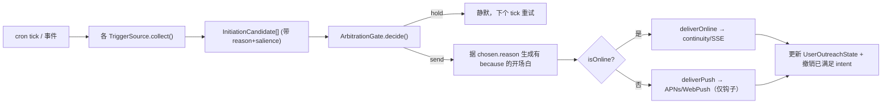

# Remi AI — Memory V3 设计文档

> 对应目标：把"记忆 / 时间感 / 主动打招呼"统一到同一套底座上，让 Web 端 10 分钟在场感主线里"她不像聊几句就失忆、知道现在几点、会主动来找你"。
>
> 前置状态：Memory V2 已交付热层+温层主链路 —— 语义 episode 聚类（pgvector）、`memory_agent` 分层召回、`brains/proactive_planner.ts` 会话内主动开口、`server/session/continuity.ts` 沉默搭话。详见 [MEMORY_V2_DESIGN.md](MEMORY_V2_DESIGN.md)。
>
> **当前状态说明（2026-06-22）**：
>
> | 阶段 | 状态 | 内容 |
> |------|------|------|
> | **M3-P0** | ✅ 已落地 | 递归摘要修复（喂回旧摘要 + 500 字封顶）+ 时间注入（带时区 now + 距上次间隔，放缓存断点后）+ 窗口放大可配（10→16 / 1000→1600）+ 缓存断点接口（interface-only，不假定 prefill 收益） |
> | **M3-P1** | ✅ 已落地 | Core Memory 差分编辑块（`brains/core_memory.ts`）—— `fromSlowBrainSnapshot` / `apply` / `render` / 有界淘汰；慢脑产出 `core_memory_edits`（add/update/remove）；Tier1 块插在 system 之后、history 之前 |
> | **M3-P2** | ✅ 已闭环（代码 + DB），待部署验证 | bi-temporal 时序事实层 —— `temporal_facts` 表 + `TemporalFactsRepository`（PG + 内存）；双时间轴（t_valid / t_invalid），过期失效不删除；慢脑抽取 `temporal_facts` 写入；**召回读路径已接** —— `context_orchestrator` → `brains/timeline_facts.ts:recallTimelineFacts`（硬超时降级 + 空结果退回 Tier0–3）→ prompt 动态尾部；`temporal_facts` 表已在 local-prod 库建好。单测 38 项绿（含 `timeline_facts` 格式化 + 早返回降级）|
> | **M3-P3a/b/c** | ⏳ 未做 | 主动发起引擎（有理由开场白 + 仲裁闸）→ 调度循环 → 离线推送（APNs/Web Push） |
>
> **待办（2026-06-22 收尾后更新）**：① ✅ Tier4 召回读路径已接（`brains/timeline_facts.ts:recallTimelineFacts`，硬超时 `REMI_TEMPORAL_RECALL_TIMEOUT_MS` 降级 + 空退回 Tier0–3，进 prompt 动态尾部）；② ✅ `temporal_facts` 表已在 local-prod 库建好 —— 该库**无 `pgmigrations` 记账、用 schema 初始化**，故手动执行 003 等效 DDL（`CREATE TABLE/INDEX IF NOT EXISTS`，仅新建全新表、不碰现有数据）而非全量 `npm run migrate:up`（后者会从 001 重跑、撞已存在的表而失败）；③ **代码改动需 `npm run prod:local:rebuild` 才在 local-prod（ai.remi.run）生效** —— 当前跑旧镜像，不含读路径召回；④ 缓存断点（§13）仍 interface-only；⑤ prompt cache 是否真复用尚未实测。**①② 完成后 M3-P2 在代码与 DB 层已闭环；端到端真机验证待 ③ 部署。** 它不替换 V2，而是在 V2 之上补四块短板；每个阶段保留 fallback（与 V2 同约束）。
>
> **落地约束**：
> - 不在 fast path（出话热路径）塞任何阻塞工作 —— 这是 V3 的硬约束，也是它能"既实时又有记忆"的前提。
> - 不强制引入新的重基础设施。bi-temporal 长期层**默认走 Postgres 扩展列**，Graphiti/Neo4j 作为可选升级，不作为运行前提（延续"数据库可选、pgvector 已有"的现实）。
> - 主动发起、前瞻回访、慢脑写入全部跑在连接热路径之外；它们引入的风险是**信任/打扰**，不是延迟。
> - 主动打招呼默认**克制优先**：宁可少发，不做 engagement-maxxing 钩子（见 §8 红线）。

---

## 0. 为什么需要 V3：一句话定位

V2 让 Remi"记得发生过什么"（语义 episode）。V3 要补的是另外三件让她"像活人"的事，且它们其实是**同一套底座的三个面**：

| 能力 | 解决的问题 | 底座 |
|------|-----------|------|
| **分层 + 可编辑记忆** | 聊几句就忘了前面（逐字窗口太短 + 摘要不累积） | 5 层 context + Core Memory 差分编辑 + 递归摘要 |
| **时间概念** | 不知道现在几点、隔了多久、事实是哪天的、是否还成立 | 注入此刻/间隔 + bi-temporal 长期层 |
| **主动打招呼** | 只会被动应答，不会先开口、不会跨会话/离线想起你 | 主动发起引擎（触发源 + 仲裁闸 + 跨端投递） |

三者共享一个事实：**都压在出话热路径之外，所以实时性不受影响。**

### V3 直接修的两个现存洞

1. **逐字窗口硬上限 5 轮**：`brains/context_orchestrator.ts` 的 `MAX_HISTORY = 10`（10 条 = 5 轮），prompt 端再被 `REMI_FAST_PATH_HISTORY_TOKENS=1000` 压到 3–4 轮。
2. **"对话摘要"不累积**：`brains/background_analysis.ts::llmAnalysis` 只取 `history.slice(-8)`，且**不把旧摘要喂回**就 `setConversationSummary()` 整条覆盖 —— 摘要镜像窗口、不延伸记忆。窗口外、又没被抽成离散 fact / shared moment 的细节，对模型就是彻底消失。

---

## 1. 核心论点：实时和记忆不是同一根轴上的取舍

把两条轴解耦，是整个 V3 的题眼：

- **延迟**只由**热路径长度**决定 = 出第一声前必须跑完的事。语音 AI 的延迟大头是 LLM TTFT 和 turn-taking，**不在历史有多长**上。
- **记忆质量**由**进 context 的压缩态质量 + 召回质量**决定，与"写记忆有多重"无关 —— 只要写在热路径之外。

杠杆是 **prompt caching**：把又大又稳的记忆放进**可缓存前缀**，命中后省掉大部分 prefill，TTFT 几乎不涨（业界数据：50–85% prefill / 延迟下降）。

> 结论：**你可以塞进比现在多 10 倍的记忆上下文，而第一声并不更慢** —— 只要按"稳定度梯度"排列，让大块记忆落在可缓存区。

当前项目用 OpenAI 兼容端点、**尚无任何显式 prompt caching**（`cache_control` 查无）。V3 的缓存策略对三种部署都生效：
- 支持显式 breakpoint 的（Anthropic）→ 打 cache 断点；
- 自动前缀缓存的（OpenAI/兼容）→ 稳定前缀自动命中；
- 自托管 vLLM/SGLang → 稳定前缀 = KV-cache 复用。

---

## 2. 分层 context：按缓存稳定度排序

每轮 prompt 由 5 个 Tier 组成，**从稳定到易变**排列，缓存边界尽量靠前：

```
        ┌─── 出话热路径 (决定 TTFT，目标 < ~250ms) ───┐
用户说话 ► ASR ► [组装prompt] ► LLM首token ► 句子切块 ► TTS首帧 ► 出声
                     ▲
   ┌─────────────────┴───────────────────────────────────┐
   │ PROMPT（按稳定度排序 = 缓存友好）                       │
   │ Tier0  人设/角色规则/行为合同      ← 纯静态 ┐           │
   │ ──────────────── cache breakpoint ───────┤ 命中即免   │
   │ Tier1  Core Memory 核心记忆块      ← 低频编辑┘ prefill  │
   │ Tier2  递归滚动摘要（覆盖窗口之外的剧情）                │
   │ Tier3  逐字近窗 N=12~20 轮（靠缓存撑大，几乎免费）       │
   │ ── 易变时间戳 / 当前情境放这之后 ──                     │
   │ Tier4  按需召回 top-k  ◄── 唯一动态项，硬超时+降级 ──────┼─┐
   └──────────────────────────────────────────────────────┘ │
                                                              │
 ┌─ 冷路径（慢脑，fire-and-forget，永不阻塞出话）───────────┐ │
 │ 抽取facts/episodes → 更新bi-temporal层 → embed存向量      │ │
 │ → 递归更新Tier2 → 差分编辑Tier1 → 抽取时间意图(§7)        │ │
 └──────────────────────────────────────────────────────────┘ │
        ▲                                                      │
        └─ 长期存储 ◄──────────────────────────────────────────┘
           pgvector(语义episode,V2已有) + bi-temporal facts(§6) + 事件日志
```

| Tier | 内容 | 稳定度 | 当前状态 |
|------|------|--------|---------|
| 0 | 人设 / 角色规则 / 行为合同 | 纯静态 | 已有（`prompt_builder.ts`），需移到缓存断点前 |
| 1 | **Core Memory** 核心记忆块（§4） | 低频编辑 | **新增**（替换假摘要） |
| 2 | **递归滚动摘要**（§5） | 慢变 | **改造**（V2 的覆盖式 → 累积式） |
| 3 | 逐字近窗 12–20 轮 | 每轮变 | 调参（`MAX_HISTORY` + token 预算放大） |
| 4 | 按需召回 top-k（语义+时序） | 每轮动态 | 扩展 V2 召回 + 加超时降级 |

**时间戳的缓存陷阱（关键）**：精确时钟每轮都变，若落在 Tier0/1 会每轮 cache miss，把缓存收益清零。规则：
- **易变精确时间**（`14:32`）→ 放 Tier3 之后的动态尾部，紧挨用户消息。
- **慢变粗粒度时间**（日期 / "晚上" / 关系时长 / 距上次间隔）→ 可进 Core Memory，跨天认一次刷新。
- 间隔在 **bootstrap 时算一次**锁定整会话，别每轮重算。

---

## 3. Tier1 — Core Memory 差分编辑块（替换假摘要）

借 MemGPT/Letta 的 core memory：一个有界（~800–1500 token）、结构化、**增量差分编辑**的块。慢脑每轮做"加一条 / 改一条 / 删一条"，**不是从窗口重新生成再覆盖**。这是对现存"假摘要"洞的根治。

结构（草案）：

```
【关于你】名字、关键事实、偏好、雷区（don't-touch）
【关于我们】关系阶段、认识时长、情感基调、当前未完的事(open loops)
【此刻】活跃线程 / 用户当前的需求 / 上次情绪续接点
```

要点：
- **差分写入**：慢脑产出 `{op: add|update|remove, slot, key, value}` 列表，由 store 应用 —— 不重写整块，缓存少失效。
- **有界 + 淘汰**：每个 slot 容量上限，超出按 salience/recency 淘汰到长期层（不是丢弃）。
- 接管 V2 `SlowBrainStore` 里已有的 relationship / workingMemory / continuityCueState，把它们**结构化成一个可序列化的 core memory 块**，而不是散落字段。

---

## 4. Tier2 — 递归滚动摘要

Letta 式 recursive summarization，真正覆盖逐字窗口之外的剧情：

```
新摘要 = LLM( 旧摘要  +  刚被挤出 Tier3 窗口的对话 )
```

- 与现状的差别：**旧摘要必须喂回**（修 `llmAnalysis` 的 `slice(-8)` + 覆盖式 bug）。
- 有界长度；触发时机 = Tier3 窗口溢出时，而非每轮。
- 原始对话仍进事件日志（§6），摘要只是热层的有损投影。

---

## 5. Tier4 / 长期层 — bi-temporal 时序记忆

陪伴 = 长期关系 = **事实会演化**（在还债 → 还清了；有对象 → 分手了）。纯向量召回会把过期的矛盾事实一起捞上来。解法是给事实加**双时间轴**：

- **valid time**：事实在现实里何时成立（`t_valid` ~ `t_invalid`）。
- **transaction/ingestion time**：何时被记录下来。
- 过期事实**置为失效，不删除**（保留时间线，支持"上个月你还在…"这类回溯）。

这正是 LongMemEval 里纯向量做不好的 *temporal reasoning + knowledge updates* 两类能力，也是时序知识图谱（Zep/Graphiti）领先的原因。

### 选型：两档，按愿意背的运维量

**默认（推荐先做）— Postgres 扩展列，不引入新基础设施**

`memories` 已有 `attributedTo / validAt` 写入语义，但缺失效区间。给"会变的事实"建独立 bi-temporal 表：

```sql
CREATE TABLE temporal_facts (
  id UUID PRIMARY KEY DEFAULT gen_random_uuid(),
  user_id UUID NOT NULL REFERENCES users (id),
  subject TEXT NOT NULL,          -- 实体，如 "用户的工作"
  predicate TEXT NOT NULL,        -- 关系，如 "状态"
  object TEXT NOT NULL,           -- 值，如 "在还债" / "已还清"
  embedding vector(768),          -- 复用 V2 embedding 栈
  t_valid TIMESTAMPTZ NOT NULL,   -- 现实中何时开始成立
  t_invalid TIMESTAMPTZ,          -- 何时失效（NULL = 仍成立）
  recorded_at TIMESTAMPTZ NOT NULL DEFAULT now(),  -- 何时被记下
  source_episode_id UUID,
  salience REAL NOT NULL DEFAULT 0
);
CREATE INDEX idx_tf_user_active ON temporal_facts (user_id) WHERE t_invalid IS NULL;
CREATE INDEX idx_tf_emb ON temporal_facts USING ivfflat (embedding vector_cosine_ops);
```

新事实进来时：语义匹配到同 subject/predicate 的旧事实 → 旧的 `t_invalid = now()`、插入新行。召回默认 `WHERE t_invalid IS NULL`，需要回溯时按 `t_valid` 查历史。

**升级档（可选）— Graphiti（开源, Apache-2.0, Zep 维护）**

需要实体-关系图推理（"用户的猫" ↔ "用户的妹妹养的" 这类跨实体关联）时，引入 Graphiti 的 bi-temporal KG（跑 Neo4j/FalkorDB）。作为长期层后端替换，不改上层接口。**非运行前提**。

---

## 6. 时间概念：拆成 6 种能力，各归各位

| 时间能力 | 例子 | 机制 | 落在哪 | TTFT 成本 |
|---|---|---|---|---|
| **此刻** wall-clock | "凌晨两点还不睡？" | 注入带时区 `now` | 动态尾部（缓存边界外） | ~0 |
| **间隔** 距上次多久 | "三天没见了" | bootstrap 算一次 last-seen 差 | Core Memory（每会话刷一次） | ~0 |
| **事件时序** | "上个月你还在还债" | bi-temporal（§5） | 长期层 / Tier4 | 在召回预算内 |
| **前瞻回访** | "今天面试咋样了？" | 时间意图存储 + cron 触发（§7） | 冷路径调度器（带外） | 0（不碰热路径） |
| **主观节奏** circadian/纪念日 | "我们认识一个月啦" | now + 关系起点 + 日历派生 | Core Memory / 语气 | ~0 |
| **时序推理** 趋势 | "你最近是不是好多了" | KG 时间查询 + 情绪轨迹 | Tier4 / 慢脑 | 在预算内 |

前 2、5 是纯字符串注入（0 检索）；3、6 搭在 Tier4 召回预算里；4 完全带外。**时间感对第一声延迟几乎零成本。**

---

## 7. 前瞻记忆调度器（prospective memory）

记住"未来要回访的事"，到点主动开口。它和 §8 的主动发起引擎共用同一个调度底座 —— 前瞻回访只是发起引擎的一个触发源。

```sql
CREATE TABLE prospective_intents (
  id UUID PRIMARY KEY DEFAULT gen_random_uuid(),
  user_id UUID NOT NULL,
  fire_at TIMESTAMPTZ NOT NULL,
  kind TEXT NOT NULL,            -- commitment | callback | anniversary | circadian
  payload TEXT NOT NULL,         -- "面试" / "交报告"
  source_episode_id UUID,
  status TEXT NOT NULL DEFAULT 'pending',  -- pending | fired | cancelled
  created_at TIMESTAMPTZ NOT NULL DEFAULT now()
);
```

- **来源**：慢脑抽取用户话里的未来时间点（"明天3点面试""周五交报告"），或派生（纪念日、带 deadline 的 open loop）。
- **触发**：服务端 cron-style tick（每几分钟扫到期意图），业界标准做法。
- **撤销**：用户自己先提了 → `status = cancelled`，不再追问。

---

## 8. 主动发起引擎（主动打招呼）

"主动打招呼"是更大的能力：她**先开口** —— 没有待办时的问候、跨会话/离线的"想你了"、把记忆翻出来找你。它整个跑在出话热路径之外（零延迟）。**难点不是"怎么发"，而是"什么时候该闭嘴"。**

```
触发候选源(多个)              仲裁闸(克制策略=灵魂)            跨连接状态投递
─────────────              ────────────────              ─────────────
· 前瞻回访(§7,已承诺的事)     ┐                            ┌ 在线(WS/SSE开着)
· 节律: 早安/晚安/周末        │   关系门槛(刚认识几乎不主动)    │  → continuity 沉默搭话(已有)
· 间隔阈值: 隔太久了          ├─► 频率上限 + 被忽略指数退避 ──┤
· 记忆翻涌: 某条未完episode   │   安静时段(深夜/上班不扰)      │ 离线/App关闭
  到该想起的时候             │   时机感(opportune moment)    │  → 推送: APNs(iOS/表)
· 情绪续接: 上次你难过→回访    │   刚聊完冷却(别立刻又发)        │     Web Push / 桌面通知
· 世界事件(RemiWorld)        ┘   去重+撤销 / 每窗口只放行1条    └ 跨设备去重(别手机+表+网页齐发)
  每个候选带【理由+显著度】                                      点开→开场白已在context,无缝接
```

### 8.1 仲裁闸（最该花力气的地方）

主动发起翻车全在这。逐条：
- **关系门槛**：刚认识几乎不主动；越熟越自然。接 `SlowBrainStore` 的 familiarity / relationship stage。
- **频率上限 + 退避**：被连续忽略 → 指数降频甚至沉默，绝不 needy。
- **安静时段**：深夜、工作时间默认不扰（除非用户设定）。
- **时机感（opportune moment）**：HCI 研究——在合适时机推送"被打扰感下降 54%"。轻量信号即可：惯常活跃时段、刚解锁手机、刚结束对话别马上又发。
- **刚聊完冷却**：会话刚结束别立刻又"打招呼"。
- **去重 + 撤销 + 选 1**：每窗口最多一条，挑显著度最高；用户先提了就撤销。

### 8.2 跨连接投递（相对 V2 真正新增的架构）

发起决策挂在**用户级**而非某条 WS 连接上：
- 在线 → 走已有 `continuity` / SSE `/api/chat/events` 通道。
- **离线 / App 关闭 → 推送**（iOS/watch APNs、Web Push、桌面通知）。当前项目**无推送基础设施**，这是新增重点。
- 多设备只挑一个端发；点开通知进来时，开场白连同理由已在 context 里，无缝接上，避免"你回来了，找我有事吗"的失忆感。

### 8.3 开场白必须有"because"

"在吗"是空的，发多了就是骚扰。开场白挂在一条记忆/时间理由上（复用 Core Memory 的 open loops、未完 episode、prospective 项）：
- "诶，你今天不是面试吗，咋样了？"（前瞻回访）
- "突然想起你说想养猫——刚看到一只超像的。"（记忆翻涌）
- "三天没见啦，最近是不是忙疯了。"（间隔）

### 8.4 红线：克制优先，不做上瘾设计

明确**不做** engagement-maxxing 钩子。Replika 因"诱导情感依赖 / 成瘾化游戏化"吃了 FTC 投诉 —— 对"数字生命"来说，**"该静则静"是护城河，不是缺失**。一个总在你忙时弹"在吗"的 AI 是负担不是陪伴。这条贴合 CLAUDE.md "别变成通用助手 / 陪伴非工具" 的定位。时间感也应**大多数时候潜在**（影响语气、是否关心），只在相关时才显式说出来；逢事报时间会很机械、掉回助手味。

---

## 9. 性能预算（延续 V2 §7 体例）

| 操作 | 频率 | 目标延迟 | 降级预案 |
|------|------|---------|---------|
| Tier0/1 缓存前缀 | 每轮 | 命中后 prefill ≈ 0 | 未命中退化到当前水平，不更差 |
| `now` + 间隔注入 | 每轮 / 每会话 | < 1ms | 纯字符串，无降级需求 |
| Tier4 召回（语义+时序） | 每轮 1 次 | **硬超时 150–250ms** | **超时退回 Tier0–3**（Core Memory 已兜住连续性） |
| 递归摘要 | 窗口溢出时 | 异步，不计回包 | 失败保留旧摘要 |
| 慢脑写入（含 bi-temporal / 时间意图抽取） | 每轮 ≤1 次（异步） | 不计回包 | 失败记日志 |
| 主动发起决策 | cron tick / 事件 | < 50ms（带外） | 失败静默，下个 tick 重试 |
| 离线推送投递 | 仲裁放行时 | 带外 | 投递失败记日志，不重试轰炸 |

**热路径上唯一的动态项是 Tier4 召回，且卡死超时。** 其余全部带外或缓存。

---

## 10. 现有嫁接点（已有 vs 新增）

| 现有文件 | 现状 | V3 改动 |
|---------|------|--------|
| `brains/context_orchestrator.ts` | `MAX_HISTORY=10` 硬上限 | 放大窗口；接 Core Memory + 递归摘要 |
| `brains/background_analysis.ts` | `llmAnalysis` 取 `slice(-8)` + 覆盖式摘要 | 改递归累积；新增 bi-temporal / 时间意图抽取 |
| `brains/background_analysis_store.ts` | 散落 relationship/workingMemory 字段 | 结构化成可序列化 Core Memory 块 |
| `brain/prompt_builder.ts` | 单段 system prompt | 拆成 Tier0–4 + 缓存断点 + 时间槽 |
| `server/config/schema.ts` | `*_HISTORY_TOKENS` / `MAX_HISTORY_TOKENS` | 放大默认；新增缓存 / 推送 / 调度开关 |
| `brains/proactive_planner.ts` | 会话内主动开口（V2） | 升级为引擎的一个**触发源 + 仲裁闸** |
| `server/session/continuity.ts` | 沉默搭话（在线、会话内） | 抽象成引擎的一个**在线投递通道** |
| `llm/embedding_client.ts`(V2) | 语义 embedding | 复用给 bi-temporal facts |

| 新增 | 职责 |
|------|------|
| Core Memory store（差分编辑） | Tier1 块的读写 + 淘汰 |
| `temporal_facts` 表 + repo | bi-temporal 长期事实层（§5） |
| `prospective_intents` 表 + 调度循环 | 前瞻记忆（§7） |
| 主动发起引擎（用户级） | 触发源汇聚 + 仲裁闸 + 跨端投递（§8） |
| 推送服务（APNs / Web Push） | 离线投递（§8.2），项目当前无 |
| prompt 缓存断点接入 | Tier0/1 缓存（§1–2） |

---

## 11. 落地路线（在前述 P0–P3 上细化）

> 每步独立可验证，保留 fallback，先跑 typecheck + 相关测试再进下一步（延续 V2 节奏）。

- **M3-P0｜立刻不"笨" + 时间感入门**（配置 + 小改，1–2 天）
  - 放大 Tier3：`REMI_FAST_PATH_HISTORY_TOKENS` 1000→1600；`MAX_HISTORY` 10→16（靠缓存撑）。
  - 修递归摘要：`llmAnalysis` 喂回旧摘要、改累积。
  - 注入 `now`（带时区，动态尾部）+ bootstrap 算 **gap-since-last** → "几天没见"立竿见影。
  - 引入 prompt 缓存断点（Tier0 之后）。
- **M3-P1｜Core Memory**（~1 周）：把散落字段重构成差分编辑块；加关系起点 / 纪念日 / circadian。
- **M3-P2｜bi-temporal 长期层**（~1–2 周）：`temporal_facts` 表 + 失效逻辑 + Tier4 时序召回；事实演化正确。
- **M3-P3a｜主动得体**（纯服务端，复用已有通道，~1 周）：在线沉默搭话升级成**有理由的开场白 + 关系门槛 + 冷却**。
- **M3-P3b｜发起引擎 + 调度**：用户级调度循环（合并 §7 前瞻调度器）+ 节律/间隔/记忆翻涌触发源 + 仲裁闸。
- **M3-P3c｜离线推送**：APNs / Web Push + 跨设备去重 + 时机模型。最重，但活人感拉满。

任务挂到 `docs/ops/TASKS.md`，前缀 `M3-`（与 W-PRES / RW- 并列的支线）。

---

## 12. 接口契约草案

> 让本文档可直接据此开工。命名为草案，落地时按现有代码风格对齐。

### 12.1 Tier1 — Core Memory（差分编辑，不整块重写）

```ts
type CoreSection = "aboutYou" | "aboutUs" | "rightNow";
interface Slot { key: string; value: string; salience: number; updatedTurn: number; }
interface CoreMemoryBlock { aboutYou: Slot[]; aboutUs: Slot[]; rightNow: Slot[]; }

type CoreMemoryEdit =
  | { op: "add";    section: CoreSection; key: string; value: string }
  | { op: "update"; section: CoreSection; key: string; value: string }
  | { op: "remove"; section: CoreSection; key: string };

interface CoreMemoryStore {
  render(): string;                       // → Tier1 文本块（缓存友好，稳定排序）
  apply(edits: CoreMemoryEdit[]): void;   // 慢脑批量应用；section 超界 → 按 salience/recency 淘汰到长期层
  snapshot(): CoreMemoryBlock;
}
```

### 12.2 §5 — bi-temporal 长期事实层

```ts
interface TemporalFact {
  id: string; userId: string;
  subject: string; predicate: string; object: string;
  tValid: Date; tInvalid: Date | null; recordedAt: Date;
  salience: number; sourceEpisodeId?: string;
}
interface TemporalFactsRepo {
  // 默认 asOf = now → 只取 t_invalid IS NULL；传历史时刻可回溯
  recall(userId: string, queryEmbedding: number[], opts: { asOf?: Date; k: number }): Promise<TemporalFact[]>;
  // 语义撞到同 subject/predicate 的现行事实 → 旧行 t_invalid=now，插新行（失效不删除）
  ingest(userId: string, fact: Omit<TemporalFact, "id" | "tInvalid" | "recordedAt">): Promise<void>;
}
```

### 12.3 §7 — 前瞻记忆

```ts
interface ProspectiveIntent {
  id: string; userId: string; fireAt: Date;
  kind: "commitment" | "callback" | "anniversary" | "circadian";
  payload: string; sourceEpisodeId?: string;
  status: "pending" | "fired" | "cancelled";
}
interface ProspectiveStore {
  schedule(i: Omit<ProspectiveIntent, "id" | "status">): Promise<void>;
  due(now: Date): Promise<ProspectiveIntent[]>;
  cancel(id: string): Promise<void>;
}
```

### 12.4 §8 — 主动发起引擎

```ts
interface InitiationCandidate {
  source: "prospective" | "rhythm" | "gap" | "memory_resurface" | "emotional" | "world";
  reason: string;        // 给开场白的 "because"，必填
  salience: number;      // [0,1]
  payload?: unknown;
}
interface TriggerSource { collect(userId: string, now: Date): Promise<InitiationCandidate[]>; }

interface UserOutreachState {
  lastOutreachAt: Date | null;
  ignoredStreak: number;            // 连续未回 → 指数退避
  lastConversationEndedAt: Date | null;
  quietHours: { start: number; end: number } | null;
  relationshipStage: string;        // 接 SlowBrainStore
  perSourceCooldown: Record<string, Date>;
}
interface ArbitrationResult { decision: "send" | "hold"; chosen?: InitiationCandidate; reason: string; }
interface ArbitrationGate {
  decide(cands: InitiationCandidate[], state: UserOutreachState, now: Date): ArbitrationResult;
}

// 投递：用户级、跨连接状态、跨设备去重
interface OutreachDelivery {
  isOnline(userId: string): boolean;
  deliverOnline(userId: string, opener: string): Promise<void>;   // → continuity / SSE（已有通道）
  deliverPush(userId: string, hook: PushHook): Promise<void>;     // → APNs / Web Push（只给钩子不给私密内容）
}
interface PushHook { title: string; body: string; deeplink?: string; } // body 不含私密 fact
```

### 12.5 主动发起数据流



---

## 13. prompt 组装与缓存断点

`buildPrompt` 产出 `PromptMessage[]`，但显式切成**可缓存前缀**与**动态尾部**两段：

```ts
const messages = [
  sysTier0,        // 人设/规则/行为合同/emotion 自标注指令 —— 纯静态
  coreMemoryTier1, // CoreMemoryStore.render() —— 低频编辑
  // ↑↑↑ 到此为缓存前缀；断点打在这里 ↑↑↑
  summaryTier2,    // 递归摘要
  ...historyTier3, // 逐字近窗 12–20 轮
  dynamicTail,     // now(精确时间) + Tier4 召回 + 当前 user 消息
];
```

各 provider 如何表达断点（**顺序规则三者通用**）：
- **Anthropic**：在 Tier1 末尾那条 message 上加 `cache_control: { type: "ephemeral" }`（可配 1h TTL）。
- **OpenAI / 兼容端点**：无显式 API，靠**稳定前缀自动命中** —— 所以"Tier 按稳定度排序 + 时间戳不进前缀"就是全部要求。
- **自托管 vLLM / SGLang**：开 `enable_prefix_caching`，稳定前缀 = KV-cache 复用。

铁律：**任何每轮都变的内容（精确时钟、Tier4 召回、user 消息）只能在断点之后**，否则每轮 cache miss、缓存收益清零。粗粒度时间（日期/"晚上"/关系时长/间隔）允许进 Tier1，跨天认一次刷新。

---

## 14. 迁移 / 测试 / 验收

### 14.1 迁移（node-pg-migrate）
- `003_temporal_facts.js` — §5 表 + 索引（含 `WHERE t_invalid IS NULL` 部分索引 + ivfflat）。
- `004_prospective_intents.js` — §7 表。
- `005_user_outreach_state.js` — §8 仲裁状态（每用户一行）。
- **内存模式降级**：无 `DATABASE_URL` 时，bi-temporal / 前瞻 / outreach 状态全部退回 V2 行为（时序层不可用、主动仅会话内），不报错。

### 14.2 测试（mocha + chai，镜像源码结构）
| 测试 | 覆盖 |
|------|------|
| `test/brains/recursive_summary.test.ts` | 旧摘要喂回 + 累积；窗口外信息不丢；有界长度 |
| `test/brains/core_memory_store.test.ts` | 差分 apply / 超界淘汰 / render 稳定排序（缓存前缀不抖） |
| `test/storage/temporal_facts.test.ts` | ingest 撞旧 → 旧行失效；`asOf` 回溯；默认只取现行 |
| `test/brains/arbitration_gate.test.ts` | 关系门槛 / 指数退避 / 安静时段 / 刚聊完冷却 / 每窗口选 1 |
| `test/brains/time_injection.test.ts` | `now` 落在动态尾部（不污染缓存前缀）；gap 计算正确 |
| `test/brains/proactive_engine.test.ts` | 触发源汇聚 → 仲裁 → 投递路由（online/push） |

> **实际现状（2026-06-22）**：已建并通过的为 `recursive_summary.test.ts`（含 `clipSummary` 用例）、`core_memory.test.ts`（文档原写 `core_memory_store`，实际命名 `core_memory`）、`temporal_facts.test.ts`（in-memory）共 33 项绿。`arbitration_gate` / `time_injection` / `proactive_engine` 三项**未建**（对应 M3-P3，未做）。

### 14.3 验收（接 V2 eval/replay 思路，样例进 `docs/evals/`）
| 维度 | 通过标准 |
|------|---------|
| 记忆 | 窗口外（>5 轮前）说过的细节仍答得上；"我们之前聊了什么"不失忆 |
| 时间感 | "现在几点 / 几天没见"答对；认识时长不脑补成老朋友 |
| 事实演化 | 还清债后不再说"你在还债"；问"上个月"能回溯旧值 |
| 主动得体 | 隔 3 天开场白带间隔且有 because；刚聊完不追发；被忽略后降频；安静时段不扰 |
| 实时性 | TTFT 不因记忆变大而升（缓存命中）；Tier4 召回超时有降级、不卡出话 |
| 隐私 | 离线推送只露钩子（"Remi 想你了"），私密 fact 不进锁屏 |

---

## 15. 决策与开放问题

### 已决策
- **embedding 维度复用 V2**：`temporal_facts.embedding` 用 768（与 V2 `nomic-embed-text` 对齐），不另起一套维度。
- **摘要必须 LLM 生成**：递归摘要走慢脑已有 LLM 调用，不用模板拼接（V2 §10 对 episode summary 的"模板够用"结论不延用到递归叙事摘要）。
- **Core Memory 编辑批量化**：默认每 **3 轮**或会话空闲时 flush 一次差分，避免 Tier1 每轮失效抵消缓存收益。
- **推送内容默认只给钩子**：私密 fact 不进通知 body（§14.3 隐私行）。
- **内存模式不强求时序层**：无 DB 退回 V2 行为（§14.1）。

### 仍开放（落地中校准，别往 runtime 堆规则）
- **bi-temporal 冲突消解阈值**：同 subject/predicate 的语义匹配阈值、"算更新还是算新事实"的边界 —— 需 eval 数据校准。
- **多端 presence 注册表**：用户级"哪个端算在线" + 跨端去重时间窗的具体实现，可复用 `DESKTOP_MULTI_DEVICE_CLERK.md` 的 session 概念。
- **Graphiti 升级时机**：何时从 Postgres bi-temporal 升到实体图（出现跨实体关联推理需求时再评估）。

---

## 16. 参考

- 分层 / 递归摘要 / core memory：MemGPT（arXiv 2310.08560）、Letta agent memory。
- bi-temporal 时序记忆：Zep（arXiv 2501.13956，LongMemEval 63.8 vs mem0 49）、Graphiti（getzep/graphiti, Apache-2.0）。
- 长期记忆评测：LongMemEval（arXiv 2410.10813，五能力：抽取/多会话推理/时序推理/知识更新/拒答）。
- 实时语音延迟：300ms 法则、TTFT 是主要隐藏延迟。
- prompt caching：Anthropic 显式断点 + TTL / OpenAI 自动前缀，prefill/延迟降 50–85%。
- 主动发起伦理与时机：Replika FTC 投诉（反成瘾化）、HCI opportune-moment 研究（打扰感降 54%）。
